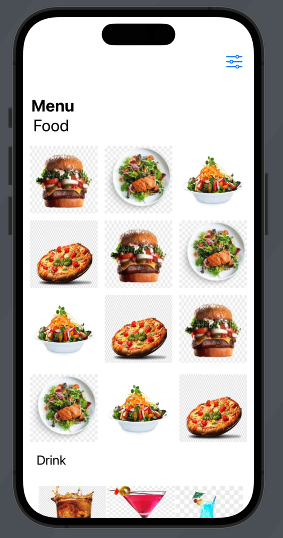
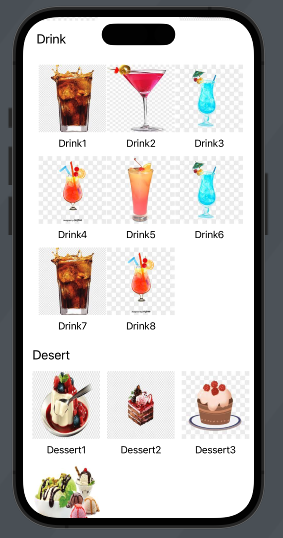
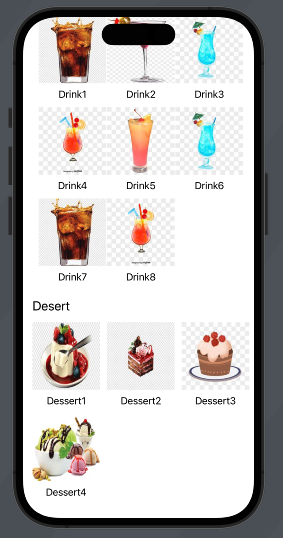
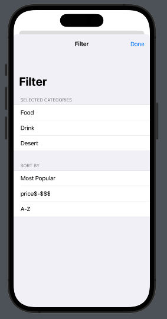
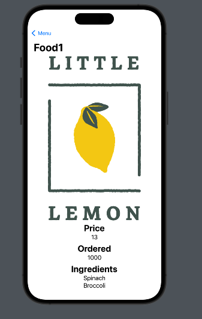

# Little-Lemon-dinner-menu 
it's a project practicing swiftui in meta ios Meta iOS Developer Professional Certificate
its a project for creating menu for restaurant 

vedio Demo :

screenshots:

